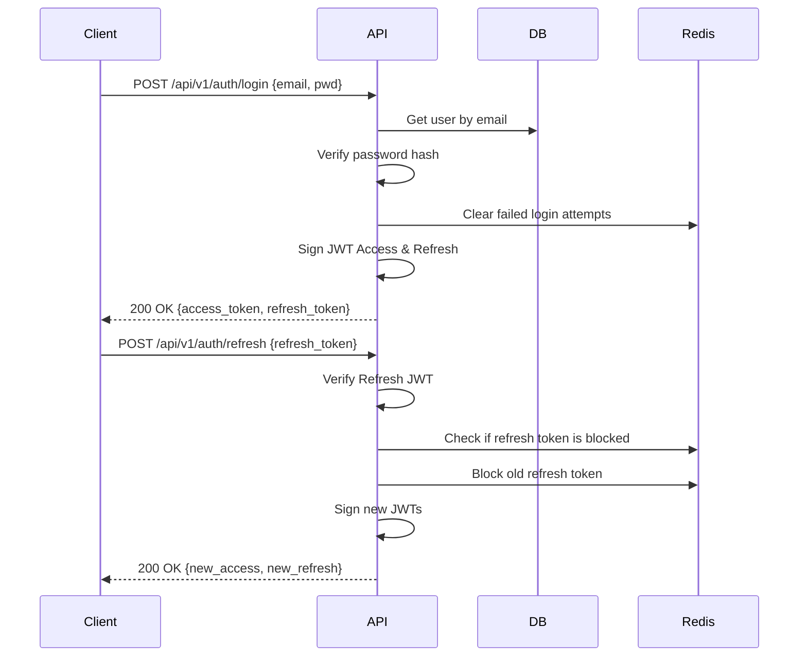

# TestLens Authentication Module

Provides JWT authentication, password hashing, OAuth2 via GitHub/GitLab, and Redis-based rate limiting and session revocation.

## Setup

```bash
pip install -r requirements.txt
uvicorn services.auth.main:app --reload
```

## Environment Variables

| Variable | Description |
|---|---|
| JWT_SECRET | Secret for signing JWTs |
| JWT_ALGORITHM | e.g. HS256 |
| ACCESS_TOKEN_TTL_SECONDS | Access token lifespan (default 900) |
| REFRESH_TOKEN_TTL_SECONDS | Refresh token lifespan (default 86400) |
| DATABASE_URL | Postgres connection string |
| REDIS_URL | Redis connection string |
| OAUTH_GITHUB_CLIENT_ID | GitHub OAuth App ID |
| OAUTH_GITHUB_CLIENT_SECRET | GitHub OAuth Secret |

## Login & Refresh Sequence


